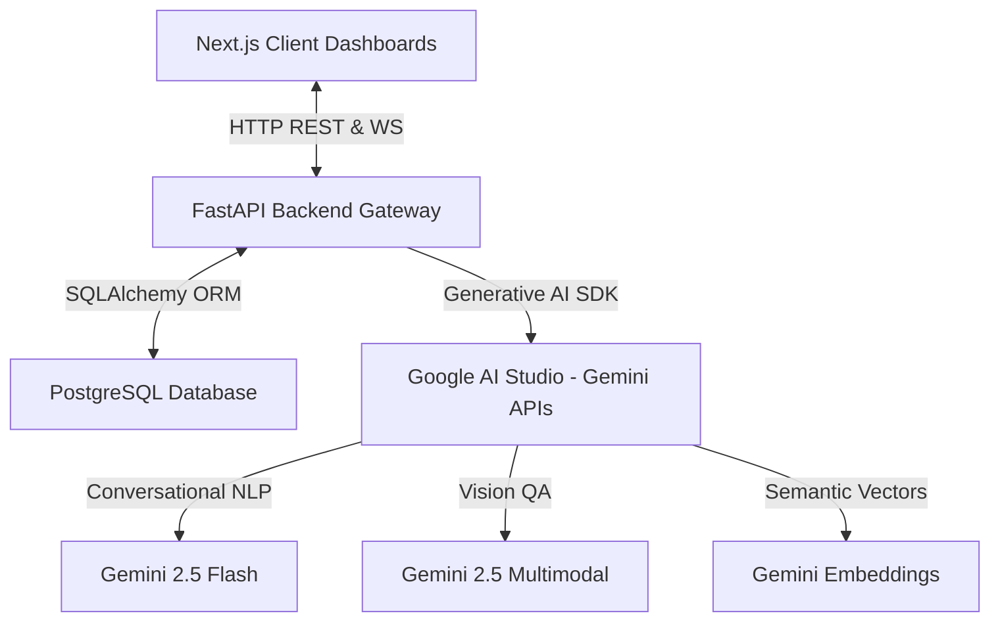
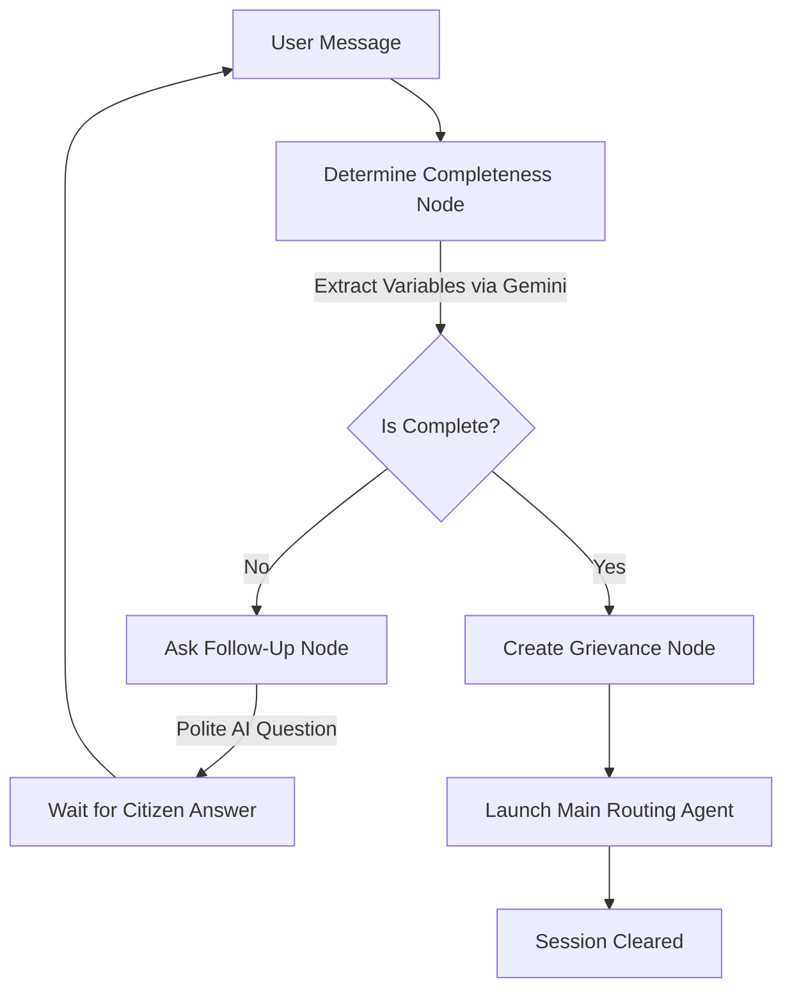
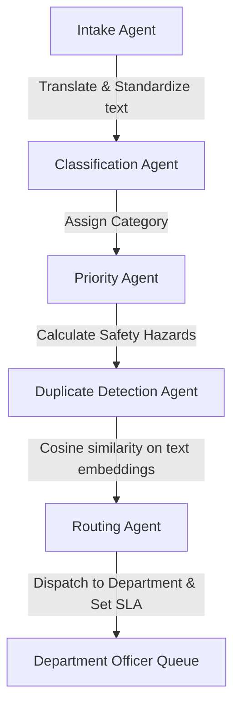

# Sahayak System Architecture

This document describes the architectural layout, multi-agent frameworks, data pipelines, and user journeys within the Sahayak GovTech platform.

---

## 1. System Topology

Sahayak uses a decoupled client-server architecture. The frontend React/Next.js pages consume Python REST endpoints and maintain asynchronous state updates via dual-channel WebSocket connections.

---

## 2. Stateless vs. Stateful Multi-Agent Pipelines

Sahayak deploys two separate **LangGraph** StateGraphs to manage the lifecycle of a grievance:

### Pipeline A: Citizen Intake Chat (Stateful & Persistent)
Manages the citizen's conversation over WhatsApp. It holds state in memory checkpointers (`MemorySaver`) so that it can pause between requests, remember previous details, and ask relevant follow-up questions.

### Pipeline B: Grievance Routing & Classification (Asynchronous Background Thread)
Launches immediately after a grievance is created. Runs sequentially to parse, classify, and dispatch the ticket.

---

## 3. Key AI Subsystems

### A. Duplicate Detection Pipeline
1. When a grievance is processed, `DuplicateDetectionAgent` computes text embeddings of the description using `models/text-embedding-004`.
2. It fetches all open active grievances in matching categories.
3. Computes the cosine similarity:
   $$\text{Similarity} = \frac{\mathbf{q} \cdot \mathbf{g}}{\|\mathbf{q}\| \|\mathbf{g}\|}$$
4. If similarity $> 0.85$, it marks the new ticket as a duplicate and links it to the parent master ticket ID, grouping identical reports instantly.

### B. Officer RAG SOP Assistant
1. When an officer selects a ticket, the dashboard requests `/assistant`.
2. The RAG system computes the embedding of the complaint.
3. Performs a vector similarity search over chunked official government Standard Operating Procedures (SOPs) and historical closed cases.
4. Returns the matched SOP context and the resolution details of similar past tickets to give the officer a clear blueprint of how to fix the issue.

### C. Vision Assurance Pipeline
1. The officer uploads a photo of the completed repair.
2. The `ResolutionAssuranceAgent` takes both the intake (before) photo and resolution (after) photo.
3. Sends them in a single multimodal request to Gemini.
4. Gemini compares the visual features of both images against a strict validation checklist (e.g. "pipe replaced", "no water leakage visible", "debris cleaned").
5. The model returns a structured JSON verification block. If approved (Confidence $\ge 80\%$), it automatically marks the ticket as `RESOLVED`.
